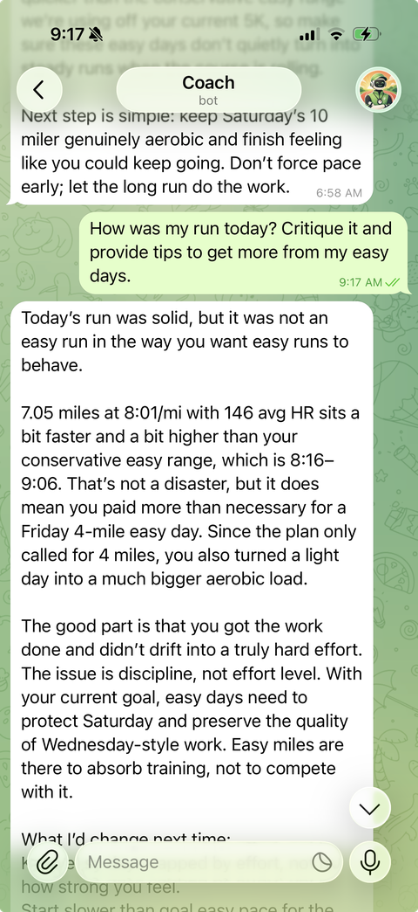

# Running Agent

A system for automated running coaching toward race goals.

It uses training and recovery data from sources like Strava and Garmin to review workouts,
adjust advice, and suggest what to do next. An athlete interacts with the system via
Telegram through a conversational interface. The system also sends scheduled messages such
as after a workout to summarize the results.



Built with Codex.

## Details

### Runtime Behavior

When `python -m running_agent telegram` is running, the bot:

- Polls Telegram for chat messages and slash commands.
- Shows Telegram's typing indicator while generating direct chat replies.
- Checks Strava on the configured interval for newly synced runs.
- Sends a natural post-run coaching note when a new run appears.
- Refreshes the Garmin snapshot cache once per day after 5:00am Eastern.
- Sends one morning workout check-in after 5:30am Eastern when today's saved plan has
  a workout and Strava does not already show a completed run for the day.
- Sends one brief end-of-day report after 8:30pm Eastern Monday through Saturday when
  Strava shows a completed run for the day.
- Sends one integrated Sunday evening review after 6:00pm Eastern, recapping a saved
  target-week plan when one exists or suggesting next week when it does not.
- Refreshes the coach's private training state once per day after 7:00pm Eastern.

### Local Data And Privacy

Runtime data lives under `.data/`, which is ignored by git:

- `.data/state.json` - Telegram chat state, scheduler markers, and last-seen activity IDs.
- `.data/weekly_plan.json` - the current saved weekly plan.
- `.data/training_goal.json` - the current saved training goal.
- `.data/athlete_profile.txt` - remembered coaching notes.
- `.data/coach_log.jsonl` - compact planned-versus-completed run outcomes.
- `.data/coach_reflection.json` - the coach's private current training state.
- `.data/pace_calibration.json` - current working VDOT and training pace calibration.
- `.data/garmin_snapshots.json` - cached Garmin recovery snapshots and baseline data.
- `.data/strava/activities.json` - synced Strava run summaries.
- `.data/strava/details/<activity_id>.json` - synced detailed Strava activities with laps.

Secrets are kept outside `.data/`: `.env`, `.strava_tokens.json`, and Garmin's token cache
under `~/.garminconnect` are all ignored by git.

### Coaching Context

The coach builds replies from local context instead of treating each message as isolated:

- Recent Strava runs, using a four-week default lookback for normal chat and summaries,
  including detailed laps when they matter, such as workouts, races, and long runs.
- The saved weekly plan in `.data/weekly_plan.json`, parsed by weekday when possible.
- The saved training goal in `.data/training_goal.json`.
- Athlete-specific notes in `.data/athlete_profile.txt`.
- The global coaching philosophy in `running_agent/coaching_philosophy.txt`.
- The current coach reflection in `.data/coach_reflection.json`, which captures compact
  private coach state: capacity, goal confidence, goal requirements/checkpoints, limiters,
  next emphasis, and watch items.
- The current working VDOT and training pace calibration in `.data/pace_calibration.json`.
- The local coach log in `.data/coach_log.jsonl`, which records planned-versus-completed
  run outcomes.
- Synced local Strava activity history in `.data/strava/`, with compact run summaries
  and per-activity detail files for lap/split lookup.
- Cached Garmin snapshots in `.data/garmin_snapshots.json`, including baseline ranges for
  sleep, resting heart rate, HRV, stress, Body Battery low, and training readiness.
- Short in-process conversation history while the bot is running.

### Local Coaching State

The bot keeps some derived coaching state locally so every reply does not have to rediscover
the same facts from scratch.

The Strava integration has two paths:

- Recent training summaries still use the Strava client directly.
- Detailed activity lookup tools read from the local store in `.data/strava/`.

Backfill the local store with:

```bash
python -m running_agent sync-strava --days 365
```

That command saves run summaries to `.data/strava/activities.json` and detailed activity
JSON to `.data/strava/details/`. Telegram polling and `/check` also save detailed activity
JSON when a new run appears, so the local store stays warm over time.

Regenerate the coach's private training state and working pace calibration with:

```bash
python -m running_agent reflect --days 42
```

That command rewrites `.data/coach_reflection.json` from recent Strava, Garmin, plan, goal,
and coach-log context. It also extracts the current working VDOT and training pace calibration
into `.data/pace_calibration.json`. Future model replies include both pieces of state.
The Telegram scheduler refreshes them once per day after 7:00pm Eastern.

When you ask a natural-language question like `what were the splits from my track workout
last week?`, the model can call local lookup tools to search synced runs and load detailed
lap data. These tools do not call Strava directly; if a run has not been synced locally, run
`python -m running_agent sync-strava --days 365`.

Only the current weekly plan is stored. Historical activity lookups should use the run's lap
data and derived workout signals; they cannot reliably compare old runs against the plan that
was current at the time unless that plan is still the saved plan.

## Setup

Activate the project virtualenv before running commands:

```bash
source .venv/bin/activate
```

After activation, use `python` for project commands. If `python` is not available, fix the
virtualenv setup before continuing.

Install the project dependencies:

```bash
python -m pip install -e .
```

### Step 1: Connect Strava

Create a Strava API app at https://www.strava.com/settings/api.

Use `localhost` for the app's authorization callback domain while developing locally.

Copy the environment template:

```bash
cp .env.example .env
```

Then edit `.env`:

```bash
STRAVA_CLIENT_ID=your-client-id
STRAVA_CLIENT_SECRET=your-client-secret
STRAVA_REDIRECT_URI=http://localhost/exchange_token
```

Generate an authorization URL:

```bash
python -m running_agent auth-url
```

Open the URL, approve access, then copy the `code` query parameter from the redirect URL and exchange it:

```bash
python -m running_agent exchange-code YOUR_CODE
```

This writes `.strava_tokens.json`, which is ignored by git.

Verify the connection:

```bash
python -m running_agent me
```

Backfill local Strava run history so the coach can answer older activity questions and
lap/split questions without fetching Strava during the model tool call:

```bash
python -m running_agent sync-strava --days 365
```

### Step 2: Connect Garmin

Garmin Connect is optional, but it gives the coach recovery context for morning workout
check-ins. Add your Garmin credentials to `.env`:

```bash
GARMIN_EMAIL=you@example.com
GARMIN_PASSWORD=your-garmin-password
```

The first coaching request that uses Garmin may prompt for a Garmin MFA code. Garmin tokens
are cached under `~/.garminconnect`.

The Telegram process refreshes completed Garmin snapshots once per day after 5:00am Eastern
and stores prior days in `.data/garmin_snapshots.json`. Today's Garmin readiness is fetched
live because it can change during the day; cached prior days provide athlete baseline ranges
and recent trend context without refetching the full baseline on every request.

### Step 3: Connect Telegram

Create a bot with Telegram's `@BotFather`, copy the bot token, and add it to `.env`:

```bash
TELEGRAM_BOT_TOKEN=123456:your-telegram-bot-token
```

Optionally set `TELEGRAM_CHAT_ID` if you already know the chat ID. If you leave it blank,
the first Telegram chat to message the bot is saved in `.data/state.json`.

For natural coaching replies, add an OpenAI API key:

```bash
OPENAI_API_KEY=sk-your-openai-api-key
OPENAI_MODEL=gpt-5.5
```

## Usage

### Run The Telegram Bot

Run the coach:

```bash
python -m running_agent telegram
```

When running under the user systemd service, systemd owns crash restarts. The local
`telegram` command runs the bot directly and lets unexpected process failures exit.

To print internal debug events in addition to received/sent message lines:

```bash
python -m running_agent telegram --debug-log
```

To print interaction traces for Telegram messages and scheduled ticks:

```bash
python -m running_agent telegram --trace-log
```

### Run The Telegram Bot On Boot

Install the Telegram coach as a user-level systemd service:

```bash
python -m running_agent install-telegram-service
```

This writes `~/.config/systemd/user/running-agent-telegram.service`, enables it for the
user systemd session, and starts it immediately. The service runs the current virtualenv's
Python from this project directory, so install it from the checked-out repo with the virtualenv
activated.

For cloud or spot instances where the process should start after a reboot before you log in,
enable linger once:

```bash
loginctl enable-linger "$USER"
```

Useful service commands:

```bash
systemctl --user status running-agent-telegram.service
systemctl --user restart running-agent-telegram.service
journalctl --user -u running-agent-telegram.service -f
```

Optional shell aliases:

```bash
alias telegram-start='systemctl --user start running-agent-telegram.service'
alias telegram-stop='systemctl --user stop running-agent-telegram.service'
alias telegram-restart='systemctl --user restart running-agent-telegram.service'
alias telegram-status='systemctl --user status running-agent-telegram.service'
alias telegram-logs='journalctl --user -u running-agent-telegram.service -f'
```

The service logs to stdout/stderr, which systemd captures in journald. App log lines do not
prepend their own timestamps because `journalctl` already supplies service timestamps.

### Chat With The Coach

Most interactions should be natural-language coaching requests. The visible slash commands
are mostly for inspection and diagnostics:

- `/recent` - summarize recent Strava run training
- `/plan` - show the current weekly plan
- `/goal` - show the current overall training goal
- `/preferences` - show remembered coaching notes and preferences
- `/check` - check for newly synced Strava runs now
- Any other message - chat with the coach using recent Strava context

The coach can remember natural-language notes when chatting. For example, if you say
`remember that I prefer long runs on Saturday`, the model may call its local note-saving tool,
store that in `.data/athlete_profile.txt`, and use it in future coaching.

The same model-tool pattern is available for goals. If you say something like
`my main goal is Boston on Oct 12, ideally 3:10`, the model may rewrite the saved goal in
`.data/training_goal.json` so future coaching uses the updated target.

Weekly plans can also be saved through natural chat. If you say something like
`here is my plan for next week`, the model may rewrite it into the plain-text weekly plan
format and save it in `.data/weekly_plan.json`.

Telegram photo messages are supported too. If you send an image such as a course screenshot,
with or without a caption, the bot downloads the Telegram image in memory and sends it to the
model alongside the usual coaching context. It does not save the image to disk.

Garmin context is also available through natural chat. If you ask about readiness, sleep,
HRV, Body Battery, stress, resting HR, or whether recovery should change today's training,
the model may call its local Garmin-readiness or Garmin-trend tools. The older `/garmin`
and `/garminweek` diagnostic commands still work, but they are no longer part of the primary
help surface.

### Add A Weekly Plan

Send the plan in Telegram or the local REPL so the coach can compare completed Strava runs
against what you intended to do:

```text
Here is my plan for this week: Mon 5 easy. Tue 6 x 800m. Wed rest. Thu 8 steady. Sat 14 long.
```

The model may call its plan-saving tool and rewrite natural text into the saved weekly plan
format. The older `/setplan <plan>` command still works, but it is no longer part of the
primary help surface.

### Add An Overall Goal

Set the larger goal in Telegram or the local REPL so the coach can interpret workouts in
context:

```text
My main goal is Chicago Marathon on Oct 11, target 3:20, stay healthy.
```

The model may call its goal-update tool and rewrite the saved goal. The older `/setgoal`
command still works, but it is no longer part of the primary help surface.

### Scheduler Details

Change the Telegram polling interval with:

```bash
python -m running_agent telegram --poll-seconds 120 --days 28
```

When a new run syncs, the bot appends a compact local coach-log entry to `.data/coach_log.jsonl`
with the matched planned workout and completed run headline. This file is ignored by git and
used as context for future plan suggestions.

The same new-run check also stores the Strava summary and detailed activity JSON under
`.data/strava/`, so future chat questions can look up that run's laps and splits locally.

The morning check-in uses Garmin readiness context when configured, plus today's matched
plan, the last week of runs, the coach log, and your overall goal. If there is no workout
scheduled for the day or Strava already has a completed run for that date, the bot sends
nothing.

The end-of-day report briefly recaps today's exercise, then gives a sleep, recovery, or
next-day note to keep in mind. It does not send on Sundays because the weekly review already
covers the day and next week. It also stays quiet on days without a completed Strava run.

If OpenAI is unavailable for a scheduled note, the bot sends nothing and retries on the next
tick instead of marking that note sent. The process also refreshes recent Strava run summaries
once per hour so later Strava edits such as renames and race tags are picked up.

## Development

### Tests

Run unit tests:

```bash
python -m unittest discover -s tests
```

### Local Diagnostics

To test the coach locally without sending Telegram messages, use the REPL:

```bash
python -m running_agent repl
```

The REPL talks to the same coach agent as Telegram. Type `/help` to list chat commands,
`/tick` to run due scheduled checks, and `/quit` to exit. By default it hides rx/tx log
lines; add `--debug-log` to see them.

To print one-line interaction traces for each REPL message or scheduled tick:

```bash
python -m running_agent repl --trace-log
```

Each trace has a `trace_id`, source, interaction type, start line, end line, status, and
duration. Traces are grouped around one top-level interaction, such as one chat message or
one scheduled tick. They go to stdout only and do not write disk logs.

To inspect the context a normal chat reply would send to the model without calling OpenAI:

```bash
python -m running_agent debug-context "How's my recovery?"
```

To preview scheduled messages without sending Telegram messages or mutating scheduler state:

```bash
python -m running_agent preview morning
python -m running_agent preview evening --date 2026-06-05
python -m running_agent preview weekly --date 2026-06-07
```

Preview output includes whether the scheduler would normally send, skip reasons, tools status,
data sources, and the generated message.

### Evals

To run local AI behavior evals:

```bash
python -m running_agent evals
python -m running_agent evals --case adjust_existing_weekly_plan
python -m running_agent evals --case image_plan_update_from_screenshot
python -m running_agent evals --case working_vdot_training_paces --debug
```

Without `--case`, the command runs all eval cases. Current evals cover weekly plan updates,
screenshot plan updates, hypothetical plan suggestions that must not be saved, local race
recall, working VDOT pace calibration, plain-text Telegram formatting, and judged coaching
quality for subjective safety cases.

Some evals use a judge model to make a criteria-based pass/fail call; set
`OPENAI_EVAL_JUDGE_MODEL` to override the default judge model. Eval model calls use
temperature `0.1`; set `OPENAI_EVAL_TEMPERATURE` to override it. By default, eval output
only shows pass/fail checks; add `--debug` to include saved plans, tool calls, and model
replies. Eval cases are key-driven: `expected` runs deterministic rule checks, `judge`
runs judge-model criteria checks, and cases can use either or both. Tool interaction
rules live under `expected.tool_calls.called` and `expected.tool_calls.not_called`.
Saved-plan content checks live under `expected.plan`.
